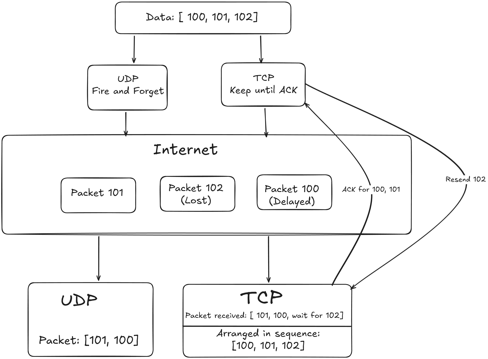
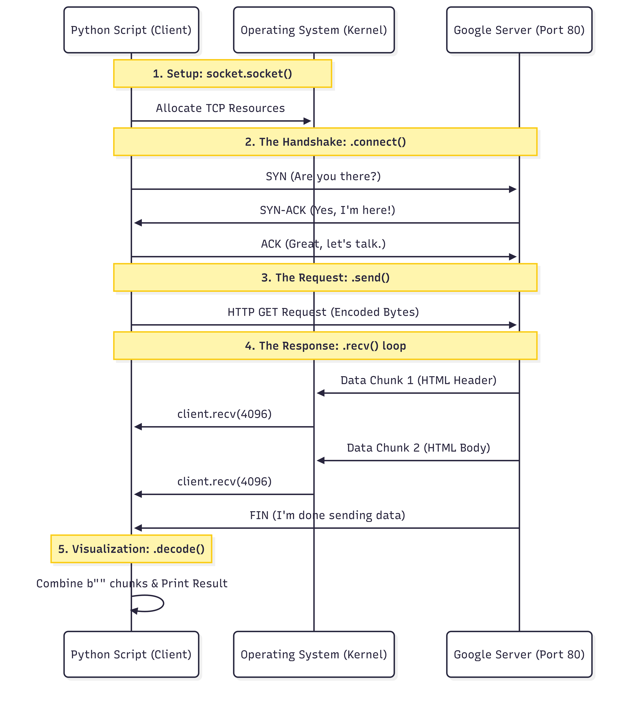

# **Backend And Networking**

## **02_01_protocol_TCP_vs_UDP**

### **The Scenerio:** 
    You are building a High-Frequency Trading (HFT) bot. You need to receive stock prices ($) as fast as possible. You choose UDP because you heard it's fast.


**02_01_sender_protocol_.py**

### UDP 
```py

import socket
import random
import time

#AF(address family)_INET = IPV4 || SOCK_DGRAM(Datagram Ptotocol) = UDP || No Handshake Fire and forget
sock = socket.socket(socket.AF_INET, socket.SOCK_DGRAM)

server_address = ('localhost', 10000)   # is a tuple, combination of IP Address + Port.

prices = ["$101", "$102", "$103", "$104", "$105", "Sell Now"]

for price in prices: 

    if random.random() < 0.5:
        print(f"Dropped packet: {price}")
        continue

    # Introduces latency
    time.sleep(random.uniform(0.01, 0.05))

    #Routing, sending Package using UDP. No connection No handshake
               #Serialization 101 -Encoding converts string to bytecode (using UTF-8)
    sock.sendto(price.encode(), server_address)
    print(f"Sent: {price}")

```

*02_01_receiver_protocol_UDP.py*
```py
import socket


sock = socket.socket(socket.AF_INET, socket.SOCK_DGRAM)

server_address = ('localhost', 10000)
sock.bind(server_address)

print("Bot is listning..............")

while True:
    data, address = sock.recvfrom(4096)


    price = data.decode()

    print(f"Received: {price} from {address}")

    if price == "Sell Now":
        print("selling stocks")
        break
```

---

### **Theory:** UDP VS TCP

1. UDP(User Datagram Protocol):
   * A connectionless Protocol
   * **Mechanism:** It takes the data, adds a tiny 8 byte header(Source Port, Desh Port, Length, CheckSum) and pushes it to the IP Layer.
   * **No State:** The OS Kernel does not remember if it sent packet #2 or #3. It just sends.
   * **No Flow Control:** If the the receiver is overwhelemed, UDP doesnt stop. It keeps sending the packets.
   * **Use cases:** Real time metrics(Gaming,Video Streaming)

2. TCP(Transmission control Protocol)
   * A connection oriented Protocol
   * **Handshake:** Before sending any packet TCP extablishes a connection.
     * **SYN**(Synchronize): Hi, I want to talk. My starting Sequence Number is 0.
     * **SYN-ACK**: I hear you. My Sequence is 5000. I acknowledge your 0.
     * **ACK** (Acknowledgement): Okay, let's go.
   * **Header:** (20-60 Bytes) Contains Sequence Number, Acknowledgement Number, Window Sze(Flow Control)
   * **Ordering**: The Receiver puts packets back in order using the Sequence Number.
   * **Retransmission**: If the Sender doesn't get an ACK within a specific time(RTO), itresends the data.
   * **Head of Line Blocking**: If Packet 1 is missing , TCP holds Packet 2 and 3 in the kernel buffer and refuses to give it to the Application layer until Packet 1 arrives. This creates lag.

---

### Visualization: 


### Step-by-Step Explanation: 

1. **Send:** Sender fires $100, $101, $102 via UDP.

2. **Jitter:** The network route for $100 is congested. It takes a longer path.

3. **Arrival**: $101 arrives at the Receiver first. The UDP Receiver says "Here is data!" and gives $101 to the app. whereas TCP holds the packets and wait for others to arrive. 

4. **Late Arrival:** $100 finally arrives. UDP gives $100 to the app. Whereas TCP sends tha ACK for 100 and 101 and the sender not receiving ACk for 102 resends the packet 102.

5. **Result:** In UDP app sees $101 then $100. The stock price apparently went back in time. Where as in TCP the App sees 100, 101, 102 though with time lag.

6. **Loss:** In UDP $102 hits a bad router and is dropped. The Sender has already forgotten about it. The Receiver never knows it existed.

---


### TCP 

*02_01_receiver_protocol_TCP_.py*
```py
import socket


server_sock = socket.socket(socket.AF_INET, socket.SOCK_STREAM)

server_address = ('Localhost', 10000)
server_sock.bind(server_address)

server_sock.listen(1)
print(f"Server is listning")

while True:
    connection, client_address =server_sock.accept()
    try:
        print(f"Connected to {client_address}")

        data = connection.recv(4096)
        if not data:
            break

        print(f"received {data.decode()}")

    finally:
        connection.close()
```

*02_01_sender_protocol_TCP_.py*
```py
import socket
import time

sock = socket.socket(socket.AF_INET, socket.SOCK_STREAM)

server_address = ('localhost', 10000)

print("Connecting to server")
sock.connect(server_address)

prices = ["$101", "$102", "$103", "$104", "$105", "Sell Now"]

try:
    for price in prices:
        sock.sendall(price.encode())
        print(f"Sent: {price}")
        time.sleep(1)

finally:
    sock.close()

```

### Questions
Q1. **The Failure:** The receiver got $102 before $101. Why does UDP allow this? Does it have a "Sequence Number"?
* UDP has No Sequence Numbers. It reads packets from the network card as they arrive. If the network delays packet A, packet B arrives first.

Q2. **The Loss:** $105 never arrived. Did the Sender know it failed? (Yes/No).
* No. The Sender did not know. UDP is "Fire and Forget."

Q3. **The Alternative:** If we switched to TCP (SOCK_STREAM), the OS initiates a "Handshake" before sending data. What are the 3 specific packets (flags) exchanged?
* * SYN (Synchronize)
  * SYN-ACK (Synchronize-Acknowledge)
  * ACK (Acknowledge)

Q4.**The Cost:** Why is TCP slower for a live video call (Zoom)? If packet #50 is lost, what happens to packet #51, #52, #53 in TCP?
* Latency (Head-of-Line Blocking). If packet #50 is lost, TCP pauses the video stream. It will not show #51, #52, or #53 until #50 is retransmitted and arrives. This causes "Buffering" or freezing. UDP would just skip #50 and show #51 (Glitch > Freeze).

Q5 **The Header:** A UDP header is tiny (8 bytes). How big is the minimum TCP Header? (20 bytes? 64 bytes?)
* UDP is 8 Bytes. TCP is 20 Bytes (minimum).

Q6 **The Fix:** If you must use UDP (for speed) but need to ensure $105 arrives (Reliability), where do you have to write the code to check for missing packets? (Kernel Mode or User Mode/Application Logic?)
* You must write the reliability logic in User Space (Application Logic). You must manually add a sequence number to your data payload ({"id": 1, "price": "100"}) and write code to sort/check them.


---
---
---

# 02_02_raw_http

### **Topic:**
 HTTP/1.1 Request (Raw Socket Level)

### The Scenario:
You need to fetch `google.com` without using a browser or a library. You must construct the raw HTTP text manually.

```py
import socket

client = socket.socket(socket.AF_INET, socket.SOCK_STREAM)
server_address = ('www.google.com', 80)

client.connect(server_address)

request = (
    f"GET / HTTP/1.1\r\n"
    f"Host: www.google.com\r\n"
    f"Connection: close\r\n"
    f"\r\n"
)

client.send(request.encode())

receive_data = b""

while True:
    chunk = client.recv(4096)
    if not chunk : break
    receive_data += chunk

print(receive_data.decode())


```

## Theory:
HTTP - HyperText Transfer Protocol as the name suggests its text-based not a binary(like TCP).

1. **The Request Line (`GET / HTTP/1.1`)**
   * **Method (GET):** The Action. "Give me this."
   * **Path (/):** The Resource. "I want the root file." (Could be /images/logo.png).
   * **Version (HTTP/1.1):** The Dialect. "I speak version 1.1."
   * **Note:** HTTP/1.1 (1997) is still the foundation. HTTP/2 and HTTP/3 are binary and compressed, but conceptually they map back to this.

2. **The Headers (Key: Value)**
   * **Host:** `www.google.com`: Mandatory in 1.1.
   * **Why?** A single server IP (142.250.1.1) might host 100 websites (`google.com`, `gmail.com`, `youtube.com`). The server needs to know which site you want. Without this, it's like mailing a letter to an apartment building but forgetting the apartment number.
   * **Connection:** close: Tells the server "Send the data and hang up." (By default, 1.1 keeps the connection open for speed).

3. **The CRLF (\r\n) Rule**
   * Unix uses \n (Line Feed). Windows uses \r\n (Carriage Return + Line Feed).
   * HTTP STRICTLY REQUIRES \r\n.
   * The Double CRLF (\r\n\r\n): This is the Delimiter. It tells the server "I am done with headers. Everything after this is the Body."

---

## Visualization: 



## Step-by-Step Explanation
1. **Socket Connect:** TCP Handshake completes. A pipe is open.
2. **Send:** convert data to bytes and travel to googele
3. **Parse**: Google's Nginx/GFE(Google Front End) reads line by line looking for \r\n.
4. **The Blank Line:** It hits the Double \r\n. It knows the metadata is over.
5. **Process:** It looks at GET /. It fetches the HTML for the homepage
6. **Reply:** It sends back HTTP/1.1 200 OK\r\n... followed by HTML.

## Questions

Q1: The Anatomy?
* GET: Method.
* /: Path.
* HTTP/1.1: Version.
* Host: Mandatory because of Virtual Hosting (multiple domains on one IP).

**Q2:** What happens if you forget the final \r\n? Does Google answer?
* Server hangs (Timeouts). It thinks you are still typing headers.

**Q3:**The output will contain Headers and HTML. How does the code know where the Headers end and the Body (HTML) begins?
* After the first Double CRLF (\r\n\r\n). The code must scan for this sequence.

**Q4:** An API uses POST to create orders. If you change GET to POST in the raw string above, what two extra things must you add to the raw string to send data (e.g., JSON)?
* Content-Length: (Size of body).
* Content-Type: (Format, e.g., JSON).

## Final Answer:
```
A raw HTTP request is a text stream separated by CRLF(\r\n)- Carriage Return Line Feed characters. It starts with the Request Line(Method, Path, Version), followed by Headers(like `Host`, which is mandatory in HTTP/1.1 for Virtual Hosting). 
The Header section must end with a double CRLF(\r\n\r\n). Without this, the server continues waiting for more headers and eventually times out.

For a Post request header so the server knows exactly how many bytes of the body to read, and Content-Type to define the payload format.
```