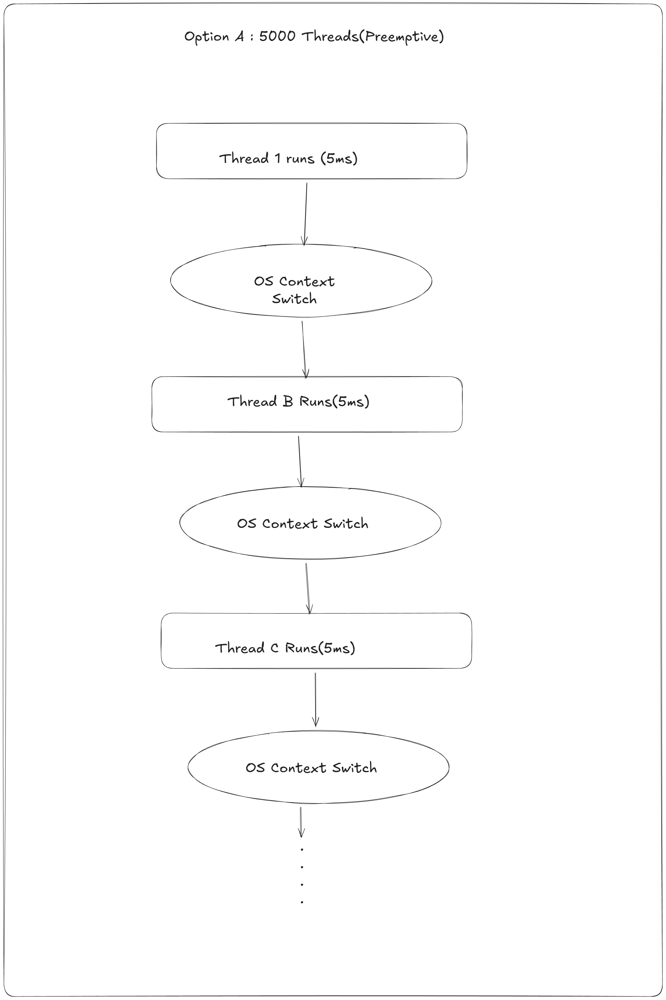
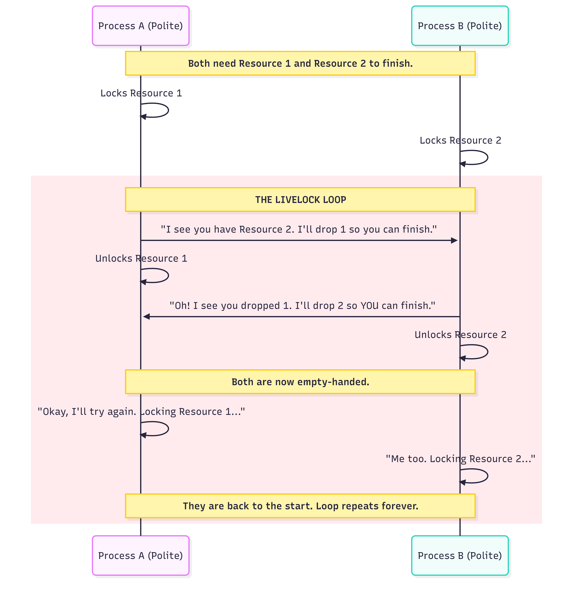

## 01_01_memory_basics_stack_heap
```
void analyze_me(){
    int local_val = 10;
    int* p1 = &local_val;
    int* p2 = new int(20);
}
```
To visualize this, imagine your RAM divided into two primary zones: the **Stack** (managed automatically, fast, LIFO structure) and the **Heap** (managed manually via `new`, slower, flexible size).

### Memory Diagram

| Memory Zone | Contents | Description |
| --- | --- | --- |
| **Stack** | `local_val` (10) | Local primitive variables. |
| **Stack** | `p1` (Address of `local_val`) | A pointer stored locally, pointing elsewhere on the stack. |
| **Stack** | `p2` (Address of `0xHeap...`) | The **pointer variable itself** is local. |
| **Heap** | `20` | The actual integer created by `new int(20)`. |

**The Visual Flow:**

1. `local_val` sits on the stack.
2. `p1` sits on the stack and has an arrow pointing to `local_val` (also on the stack).
3. `p2` sits on the stack, but its arrow crosses over into the **Heap** to point at the value `20`.


---

### Questions

**1. Does the variable p2 (the pointer itself) live on the Stack or the Heap?**
The variable `p2` lives on the **Stack**. In C++, any variable declared inside a function without the `static` keyword (like `int* p2`) is a local variable, and all local variables are allocated on the stack.

**2. Does the integer value 20 live on the Stack or the Heap?**
The integer value `20` lives on the **Heap**. This is because it was created using the `new` keyword. `new` tells the OS to find a spot in the heap large enough for an integer, initialize it to 20, and return that address.

**3. If p2 consumes 8 bytes of memory, where are those 8 bytes located?**
Those 8 bytes are located on the **Stack**. A pointer is just a variable that holds a memory address. While the *data* it points to is on the heap, the 8-byte address (the "house number") is stored in the `p2` slot on the stack.

---
---
<br>

## 01_02_arrays_and_decay

```
void tricky_arrays(){
    int arr[3] = {5,6,7};
    int* p = arr;
}
```

### Memory Diagram (The Stack)

| Stack Address | Variable | Data/Value |
| --- | --- | --- |
| `0x1000` | `arr[0]` | `5` |
| `0x1004` | `arr[1]` | `6` |
| `0x1008` | `arr[2]` | `7` |
| `0x100C` | `p` | `0x1000` (Points to `arr[0]`) |

**The Visual Logic:**

* `arr` occupies **3 contiguous boxes** on the stack.
* `p` occupies **1 box** (8 bytes on a 64-bit system).
* **Crucial Insight:** `arr` does **not** have an arrow. `arr` *is* the boxes. It doesn't "store" the address `0x1000` in a separate variable; it simply starts at that location.


---

### Questions

**1. Does arr have an arrow? (Does arr store a memory address like p does?)**
**No.** This is the "Lie." Unlike the pointer `p`, `arr` is not a separate variable that holds an address. It is a label for a specific block of memory. When you use `arr`, the compiler substituted the address of the first element, but there is no "pointer variable" for `arr` taking up space on the stack.

**2. What is the sizeof(arr)?**
**12 bytes.** Since `arr` is an array of 3 integers and a standard `int` is 4 bytes, the total size is . The array remembers its total size within the scope where it is defined.

**3. What is the sizeof(p)?**
**8 bytes.** On a 64-bit system, all pointers (regardless of whether they point to an `int`, a `char`, or a complex `struct`) are 8 bytes because they must be large enough to hold any possible memory address.

**4. If I assume arr is at address 0x1000, what is the value stored in p?**
The value stored in `p` is **0x1000**. When you execute `int* p = arr;`, the array "decays" into a pointer to its first element (`&arr[0]`).

---
---
<br>

## 01_03_memory_dangling

```cpp
void main() {
    int* p2 = new int(20); // 0x500
    int* p3 = p2;          // 0x500
    
    delete p2;   // Memory at 0x500 is freed
    p2 = nullptr; // p2 is now safe

    *p3 = 50;    // CRASH: p3 is dangling
}

```


### Memory Diagram (Post-Line B)

| Memory Zone | Contents | State |
| --- | --- | --- |
| **Stack** | `p2` | `nullptr` (0x0) |
| **Stack** | `p3` | `0x500` (The Dangling Pointer) |
| **Heap** | `0x500` | **FREED / INVALID** |

---


### **Step-by-Step Visualization**

#### **Step 1: Initialization**

```cpp
int* p2 = new int(20);
int* p3 = p2;

```

**Status:** Both pointers hold the address `0x500`. The Heap at `0x500` is valid (owned by you).


---

#### **Step 2: The `delete` Command**

```cpp
delete p2;  // <--- LINE A

```

**Status:**

* **Stack:** `p2` **STILL** holds `0x500`. It did not change.
* **Stack:** `p3` **STILL** holds `0x500`. It did not change.
* **Heap:** The block at `0x500` is now **DEAD** (Freed).

**CRITICAL:** `p2` is now a "Dangling Pointer". It points to memory that is no longer yours.


---

#### **Step 3: The Safety Measure**

```cpp
p2 = nullptr; // <--- LINE B

```

**Status:**

* **Stack:** `p2` is now `0` (Safe). If you try to use `p2`, it will crash cleanly (Segfault on NULL).
* **Stack:** `p3` **STILL** holds `0x500`. `p3` did not get the memo. It is still pointing to the dead body.


---

#### **Step 4: The Crash (Use After Free)**

```cpp
*p3 = 50; // <--- LINE C

```

**Why it crashes:**

1. The CPU reads the value inside `p3` (`0x500`).
2. It goes to memory address `0x500`.
3. The Memory Manager says: **"HEY! You told me I could have this back! You don't own this anymore!"**
4. **Result:** Segmentation Fault (Crash) or, worse, you overwrite memory that the OS just gave to a completely different part of your program (Heap Corruption).

---
**Q1: After LINE A runs, look at p2 on the Stack. Does the box p2 physically change?**
No, the box `p2` does **not** physically change. It still holds the address `0x500`. `delete` only tells the Heap Manager that the memory at that address is no longer in use; it does not "wipe" the pointer variable on the stack.

**Q2: After LINE A runs, look at the Heap address 0x500. What is there now?**
The value `20` might still be there physically, but logically, it is **Deallocated/Junk**. The Heap Manager marks that block as "Free," meaning it can be overwritten by any other part of the program at any moment.

**Q3: LINE C will crash the program. Why?**
Line C crashes (or causes undefined behavior) because **p3** is a **dangling pointer**. While `p2` was safely set to `nullptr` in Line B, `p3` still holds the address `0x500`. When you attempt to assign `50` to `*p3`, you are trying to write to a memory location that is no longer **valid** for your use.

---

### Key Takeaways

* **Delete vs. Null:** `delete` affects the **Heap**; `nullptr` affects the **Stack**.
* **The Alias Trap:** Setting one pointer to `nullptr` does nothing to other pointers (`p3`) that were copied from it.
* **Safety Rule:** Always be aware of "aliases" (multiple pointers to the same memory). If you delete the memory, all aliases become dangerous.

---
---
<br>

## 01_04_stack_recursion

```python
def recursive(n):
    data = 10  # Local variable
    # STOP HERE
    recursive(n + 1)

recursive(1)

```

### Memory Diagram (At `n=3`)

| Memory Zone | Frame | Contents | State |
| --- | --- | --- | --- |
| **Stack (Top)** | `recursive(3)` | `n=3`, `data=10` | **Active** (Running) |
| **Stack** | `recursive(2)` | `n=2`, `data=10` | **Frozen** (Waiting for n=3) |
| **Stack** | `recursive(1)` | `n=1`, `data=10` | **Frozen** (Waiting for n=2) |
| **Stack (Bottom)** | `Global/Main` | `Script Definitions` | **Frozen** |

---

### **Step-by-Step Visualization**

#### **Step 1: First Call `recursive(1)`**

The CPU creates a new "Stack Frame". It pushes the return address (so it knows where to go back to) and allocates space for `n` and `data`.



---

#### **Step 2: Second Call `recursive(2)**`

`recursive(1)` pauses at the line `recursive(n+1)`. A **new** frame is pushed on top. Crucially, `data` here is a **new integer** at a different address.



---

#### **Step 3: Third Call `recursive(3)`**

The Stack grows deeper. We now have three copies of `10` and three return addresses cluttering RAM.


### **Questions**

**Q1: How many "Frames" are currently active?**<br>
**4 Frames** (Global + 3 recursive calls).
Each frame consumes physical bytes. The CPU context switch must manage these layers.

**Q2: Is it the same `10` in physical RAM?**<br>
**NO.** Each frame has its own distinct copy.
`recursive(1)` has a `10` at address `0x9000`.
`recursive(2)` has a `10` at address `0x8FE0`.
They are totally independent. This is why recursion is memory-heavy compared to loops.

**Q3: What physical hardware limit would you hit?**<br>
**The Stack Pointer Limit (Stack Overflow).**
The Stack is a fixed-size segment of RAM (e.g., 8MB). If you recurse infinitely, the "Stack Pointer" register (ESP/RSP) decrements until it points to an address outside the allowed Stack range. The CPU's Memory Management Unit (MMU) catches this illegal access and triggers a hardware exception (Page Fault), which the OS turns into a crash (Segfault).

---

### **Key Takeaways**

* **Recursion = Allocation:** Every function call is a memory allocation (Stack Frame).
* **Locals are Private:** Variables with the same name in different frames are physically different bytes.
* **The Hardware Limit:** The "Stack" is physically small. Infinite recursion crashes not because of "logic" but because you physically ran out of the reserved RAM slot.

---
---

## 01_05_virtual_memory

```cpp
// Program A (PID: 1001)
int* p = new int(999); // Address: 0x5000

// Program B (PID: 1002)
int* p = new int(888); // Address: 0x5000

```

### Memory Diagram (The "Big Lie")

| Process | Virtual Address (The Lie) | Hardware Map | Physical RAM (The Truth) | Value |
| --- | --- | --- | --- | --- |
| **Proc A** | `0x5000` | **MMU Map** -> Frame #10 | Address `0x800010` | `999` |
| **Proc B** | `0x5000` | **MMU Map** -> Frame #55 | Address `0x900055` | `888` |

---

### **Step-by-Step Visualization**

#### **Step 1: The Request**

Both programs ask the OS for memory. The OS Virtual Memory Manager says: "Sure, you both get `0x5000`."

* Process A writes `999`.
* Process B writes `888`.

#### **Step 2: The Translation (The MMU)**

When Process A's CPU tries to access `0x5000`:

1. The CPU sends `0x5000` to the **MMU**.
2. The **TLB** (Cache) checks: "Do I know where `0x5000` is for Process A?"
3. **Hit:** It points to Physical Frame #10.
4. Data `999` is stored at Physical RAM `0x800010`.



#### **Step 3: The Context Switch**

The OS pauses Process A and switches to Process B.

* **Crucial Step:** The OS **flushes** (clears) the TLB or changes the Page Table Register.
* Now, when Process B asks for `0x5000`, the MMU translates it to Frame #55.
* Process B reads `888`. It has no idea `999` even exists.

---

### **Questions**

**Q1: Same physical RAM cell?**<br>
**NO.** `0x5000` is a virtual offset relative to the process, not a physical location.

**Q2: Does Program B see 1 or 888?**<br>
**888.** Memory is strictly isolated. One process generally cannot touch another's memory without explicit Shared Memory setup.

**Q3: The Hardware Component?**<br>
**MMU (Memory Management Unit).**
* **Nuance:** The TLB is the *cache* inside the MMU. If you said TLB, you are thinking about performance (which is good), but the MMU is the actual hardware unit doing the work.

---

### **Key Takeaways**

* **Pointers are Liars:** In C++, `&x` is never the real address. It is a virtual key.
* **Protection:** If Process A goes rogue and writes to random pointers, it destroys its own virtual space, but it cannot overwrite Process B's physical frames (Segfault).
* **The Cost:** Every memory access goes through the MMU. This is why TLB Hits are critical for speed.

---
---

# 01_06_cpu_cache_false_sharing

```cpp
#include <iostream>
#include <thread>
#include <chrono>


struct PlayerStats{
    long health;
    long armor;
};
PlayerStats stats;

void updateHealth(){
    for(int i=0; i<100000000; i++){
        stats.health++;
    }
}

void updateArmor(){
    for(int i = 0; i<100000000; i++){
        stats.armor++;
    }
}

int main(){

    auto start = std::chrono::high_resolution_clock::now();

    std::thread t1(updateHealth);
    std::thread t2(updateArmor);

    t1.join();
    t2.join();

    auto end = std::chrono::high_resolution_clock::now();
    std::chrono::duration<double> diff = end -start;

    std::cout<<"Time taken: "<< diff.count() << std::endl;

    return 0;
}
```

## Output:
 

## Theory

**What is a Core?** <br>
A Core is a complete independent CPU execution unit. It has its own Registers and its own L1/L2 Cache. It shares the main RAM and L3 Cache with other cores. Core A can not look at Core B's L1 Cache.

**Cache Line (The Granularity of RAM)** <br>
The CPU never reads a single byte or a single integer(4 bytes) from RAM. It is too slow. Instead it grabs a Chunk of memory called a Cache Line.
* Standatd Size: 64 Bytes
* If you ask for `health` (8 bytes), the CPU drags the entire 64 byte neighborhood (including armor) into the cache.

**MESI Protocol** <br>
Since Core A and core B have separate caches they must agree on the truth. A cache line can only be written by one core at a time. If Core A modifies any byte in the line, Cre B's copy of the entire line is marked Invalid. Core B is forced to dump its cache and re-fetch from RAM.


## Memory Visualization (The Ping-Pong War)


**Step-by-step Ecplanation**
1. **Load**: Core A loads the Cache line to edit health. Core B loads the line to edit armor.    
2. **Conflict**: Core A modifies `health`. Hardware requires exclusive ownership of th whole Cache line.
3. **Kill**: Core A sends a signal to all: "I touched this line. Everyone else destroy your copies(Invalidate).
4. Core B tries to write `armor`. It looks in its cache. The line is dead. It must pause, go to RAM and fetch the updated line from Core A.
5. Core B modifies `armor`. It now owns the line. It kills Core A's copy.
6. **Result**: This turned a memory operation(1 cycle) into hardware synchronization war (100+ cycles).


 # Fix:
 We must ensure `health` and `armor` live on different Cache Lines so the cores dont fight.
 Use `alignas` to force the compiler to put health and armor in different Cache Lines.

 ```cpp
#include <iostream>
#include <thread>
#include <chrono>       // chrono is a modern c++ time library


struct PlayerStats{
    alignas(64) long health;       // <- Used alignas
    alignas(64) long armor;         // <- Used alignas
};
PlayerStats stats;

void updateHealth(){
    for(int i=0; i<100000000; i++){
        stats.health++;
    }
}

void updateArmor(){
    for(int i = 0; i<100000000; i++){
        stats.armor++;
    }
}

int main(){

    auto start = std::chrono::high_resolution_clock::now();

    std::thread t1(updateHealth);
    std::thread t2(updateArmor);

    t1.join();
    t2.join();

    auto end = std::chrono::high_resolution_clock::now();
    std::chrono::duration<double> diff = end -start;

    std::cout<<"Time taken: "<< diff.count() << std::endl;

    return 0;
}

```

## 

**Why this works:** Now, health is on Cache Line X. armor is on Cache Line Y. Core A grabs Line X. Core B grabs Line Y. They never talk to each other. True Parallelism.

# Questions:
Q1: Does writing to health logically change armor?
No. Logically, in C++ code, they are independent.

Q2: How big is a standard Cache Line? <br>
64 Bytes-the hardware grabs 64 bytes. This means health and armor (8 + 8 = 16 bytes total) are physically inseparable in the cache.

Q3: If Core A modifies health, what happens to Core B's chunk? <br>
It becomes INVALID. Even though Core B only wants armor, the entire line is trashed because the hardware manages memory in 64-byte chunks, not individual variables.

Q4: Why is it slow? Bus Contention (Traffic Jam).<br>
The CPU spends all its time synchronizing the cache line between cores (sending "Invalidate" signals) rather than actually doing the math. This is called False Sharing.


# Key Takeaways
1. **False Sharing:** When two threads modify independent variables that effectively sit on the same Cache Line.

2. **64 Bytes:** The CPU grabs memory in chunks. If you touch Byte 0, you own Byte 63.

3. **Performance cost:** False Sharing causes "Cache Thrashing," reducing multicore performance to worse than single-core.

---
---
# 01_07_deadlock_banking

```cpp

struct Account {
    int id;
    int balance;
    std::mutex m; // Lock to protect this specific account
};

// Function runs on multiple threads
void transfer(Account& from, Account& to, int amount) {
    // 1. Lock the sender
    from.m.lock();
    // 2. Lock the receiver
    to.m.lock(); 
    
    // Critical Section (Move Money)
    from.balance -= amount;
    to.balance += amount;

    // 3. Unlock both
    to.m.unlock();
    from.m.unlock();
}
```
---
**Complete Code**
```cpp
#include <iostream>
#include <thread>
#include <mutex>

struct Account{
    int id;
    int balance;
    std::mutex m;
};

void transfer(Account& from, Account& to, int amount){

    from.m.lock();

    std::this_thread::sleep_for(std::chrono::milliseconds(10)); //used to get forced deadlock

    to.m.lock();


    from.balance -= amount;
    to.balance += amount;

    to.m.unlock();
    from.m.unlock();
}

int main(){
    Account A{1, 1000};
    Account B{2, 500};

    std::thread t1(transfer, std::ref(A), std::ref(B), 100);
    std::thread t2(transfer, std::ref(B), std::ref(A), 50);

    t1.join();
    t2.join();

    std::cout <<"Done\n";
}
```
**Output**


## Theory
**Conditions of Deadlock**:
1. **Mutual Exclusion**: Only one thread can hold the resource.
2. **Hold and wait**: I have a lock, and I am waiting for another.
3. **No Preemption**: You can not forcibly steal a lock from another thread.
4. **Circular Wait**: A->B->A. 

## Diagram:


### **Step-by-Step Visualization**

1. **T-Minus 0:** Thread 1 calls `transfer(Alice, Bob)`. Thread 2 calls `transfer(Bob, Alice)`.
2. **Step 1:**
* Thread 1 runs `from.m.lock()`. `from` is Alice. **Thread 1 holds Lock Alice.**
* Thread 2 runs `from.m.lock()`. `from` is Bob. **Thread 2 holds Lock Bob.**


3. **Step 2 (The Trap):**
* Thread 1 runs `to.m.lock()`. `to` is Bob. Bob is held by Thread 2. **Thread 1 Sleeps.**
* Thread 2 runs `to.m.lock()`. `to` is Alice. Alice is held by Thread 1. **Thread 2 Sleeps.**


4. **Result:** The OS Scheduler sees both threads are "Waiting." It puts them to sleep forever. The banking system freezes.

---


## Questions

**Q1: What happens next line?**
* **Stalemate (Blocking).** Both threads enter a `BLOCKED` state. They consume 0% CPU but will never wake up.

**Q2: The Wait Graph?**
* See diagram above. It is a **Cycle**. T1 -> LockB -> T2 -> LockA -> T1.


**Q3: The Fix?**
* **Global Lock Ordering.** We must ensure that everyone locks accounts in the **same order**, regardless of who is sender/receiver.

---

### **THE FIX: Lock Hierarchy (Ordering by ID)**

We ignore who is "from" and who is "to." We always lock the account with the **Lower ID** first.

This breaks "Circular Wait." If both threads try to touch Alice and Bob, **BOTH** will fight for Alice first. One wins, one waits. No deadlock.

```cpp
#include <iostream>
#include <thread>
#include <mutex>

struct Account{
    int id;
    int balance;
    std::mutex m;
};

void transfer(Account& from, Account& to, int amount){

    std::mutex *first, *second;

    if (from.id < to.id){
        first = &from.m;
        second = &to.m;
    } else {
        first = &to.m;
        second = &from.m;
    }

    first->lock();

    std::this_thread::sleep_for(std::chrono::milliseconds(10)); //used to get forced deadlock

    second->lock();


    from.balance -= amount;
    to.balance += amount;

    first->unlock();
    second->unlock();
}

int main(){
    Account A{1, 1000};
    Account B{2, 500};

    std::thread t1(transfer, std::ref(A), std::ref(B), 100);
    std::thread t2(transfer, std::ref(B), std::ref(A), 50);

    t1.join();
    t2.join();

    std::cout <<"Done\n";
}

```

*Note: In modern C++17, we simply use `std::scoped_lock lock(from.m, to.m);`, which uses a deadlock-avoidance algorithm internally. But we must understand the ID sorting logic to understand **how** it works.*

---
## Output


### **Key Takeaways**

1. **Circular Wait:** The root cause of deadlock is usually `A waits for B, B waits for A`.
2. **Lock Ordering:** The universal cure is to agree on a global order (e.g., Memory Address order, ID order) and always acquire locks in that sequence.
3. **Hold and Wait:** Never hold a lock while waiting for another unless you are sure of the order.

---
---

# 01_08_syscall_overhead

```cpp
import time
import os

data_chunk = b'a' * 1024 * 1024 * 100


def approach_A_slow():
    with open("slow.txt", "wb") as f:
        for _ in range(1024*1024 * 100):
            f.write(b"a")

start = time.time()
approach_A_slow()
end = time.time()
print(f"Approach A byte by byte write: : {end - start:.6f} seconds")

def approach_B_fast():
    with open("fast.txt", "wb") as f:
        f.write(data_chunk)

start = time.time()
approach_B_fast()
end = time.time()
print(f"Approach B took: {end - start: .6f} seconds")

os.remove("slow.txt")
os.remove("fast.txt")
```

## Theory
Modern CPU runs in two different privilage levels - User mode(Ring 3) and Kernel Mode(Ring 0 )

* **User Mode:** Where your code(Python/Browser) runs. It is restricted. It can not touch the disk, network drivers or memory directly.

* **Kernel Mode:** Where the OS(linux/Windows) runs. It has 'God Mode'  access to hardware. 

**System Calls(Syscall):** To write a a file, a Python program can not just do it. It must first ask the OS. This request is called Syscall. This is not a function call. It is a **System Interrupt(trap)**. The CPU must stop your program, save the state , swith to the hardware mode flag, jump to the OS mode, do the work and switch back.

**Cost:** A standard function call takes 1 nanosecond, A system takes 1000 nanoseconds. If you do it 1 million times. A system call will waste 1 second just on asking permission.

## Memory Visualization



## Step-by-Step Explanation
1. **The Call:** The Python Code calls `f.write(b"a")`
2. **The Trap:** The CPU triggers an interrupt.
3. **The Switch:** The CPU saves all the registers(variables) to RAM. It Switches the **Privilage bit** from User to Kernel.
4. **The Execution:** The OS Kernel wakes up, checks if you have the permission to write to this file, talks to the SSD driver , and places the bytes in write queue .
5. **The Return:** The OS returns restores the registers,switches the Privilage Bit back to the User , and resumes the Python script.
6. **The Loop:** Approach A does this massive context switch 1000000 time while Approach B does it once.

## Flaw

While Approach B is the fastest for small datasets, it suffers from a critical scalability issue: Memory Consumption.
In Approach B, the entire dataset must be loaded into the User Space RAM before the System Call is even triggered.
**The Problem:** If you attempt to write a 50GB file on a machine with only 16GB of RAM, your program will crash with an OutOfMemory error or cause the OS to enter a "swapping" death spiral.
 
## The fix
By using a Fixed-Size Buffer, we create a "streaming" pipeline. We only ever hold a tiny amount of data (e.g., 64KB) in RAM at any given moment, regardless of whether the final file is 1MB or 1TB.

```py
import time
import os

buffer = bytearray()

def approach_buffer():
    for i in range(10000000):
        buffer.extend(b"a")

        if len(buffer) >= 1024*1024: 
            with open("fast.txt", "ab") as f:
                f.write(buffer)
                buffer.clear()

start = time.time()
approach_buffer()
end = time.time()
print(f"Approch Buffer fix took: {end-start: .6f} seconds")
```
### Why this works

We replaced 4,096 expensive System Calls with 1 System Call + 4,096 cheap memory operations. RAM is fast; Mode Switching is slow.

### Questions

**Q1: Why is A slower?**<br>
It triggers 1,000,000 **Context Switches**. The CPU spends more time saving/restoring state and checking permissions than actually writing data.

**Q2: What are the two modes?**<br>
**User Mode** (Ring 3) and **Kernel Mode** (Ring 0).

**Q3: Who takes control?**<br>
The **OS Kernel** (via the Interrupt Handler).

**Q4: How many transitions for B?**<br>
**One** (technically two: one into Kernel, one back out).

### Key Takeaways

1. **Syscalls are Expensive:** Treat them like network calls. Don't do them inside a tight loop.
2. **The Boundary:** There is a physical hardware wall (Privilege Rings) between your code and the hardware. Crossing it costs CPU cycles.
3. **Buffering:** The universal solution to I/O latency. Group small tasks into one big batch.

---
---

# 01_09_fragmentation

```cpp
void fregmentation_scenerio(){
    std::vector<void*> ptrs;

    for(int i = 0; i<1000000; i++){
        ptrs.push_back(new char[1024]);
    }

    for(int i = 0; i< 1000000; i+=2){
        delete[] (char*) ptrs[i];
        ptrs[i] = nullptr;
    }

    char* bigblock = new char[200*1024*1024];

}

```

## Theory

**External Fragmentation:** occurs when when the free memory is separated into small blocks and is scattered by the allocated memory. Free memory exists but it is divided into small non contiguous blocks. Even if the total free memory is sufficient, a large process cannot be loaded because no single free block is big enough.

## Memory Visualization 
**Swiss Cheese Heap**


## Step by Step Visulaization

**Step 1 (Allocation):** You lay down 1,000,000 bricks side-by-side. The Heap is perfectly packed.
* [Brick][Brick][Brick][Brick]...

**Step 2 (Fragmentation):** You remove every second brick.
* [Brick][Hole][Brick][Hole]...

**Step 3 (The Crash):** You try to place a massive 2GB Slab.
* The Allocator scans the holes.
* "Is Hole 1 big enough?" No (1KB).
* "Is Hole 2 big enough?" No (1KB).
* ... Scan finished. No slot found.
* CRASH (std::bad_alloc).

## Fix
We stop using `new` and `delete` for individual objects. Instead we allocate one giant block at startup (preallocation) and manage the "slots" manually(i.e it has its own set of rules to manage that particular giant block of memory). This prevents External Fregmentation but there can still be internal fregmentation.
```cpp
#include <iostream>
#include <exception>
#include <vector>

using std::cout;
using std::endl;
using std::vector;
using std::cerr;

struct Particle{
    char data[1024];
    bool active;
};

class ParticlePool{
    vector<Particle> pool;

public:
    ParticlePool(size_t size){
        pool.resize(size);
        for(auto& p : pool){
            p.active = false;
        }
    }

    Particle* spawn(){
        for(auto& p : pool){
            if(!p.active){
                p.active = true;
                return &p;
            }
        }
        return nullptr;
    }

    void kill(Particle* p){
        p->active = false;
    }


};

int main(){

    ParticlePool mypool(1024);

    vector<Particle*> activeParticles;

    for(int i =0 ; i< 200*1024; i++){
        Particle* p=  mypool.spawn();
        if(p){
            activeParticles.push_back(p);
        }
    }

    cout<<"Success"<<endl;


    return 0;
}

```

## Why this Works:
* **Zero Fragmentation:** The std::vector reserves one solid chunk of memory. It never grows or shrinks during the game loop.

* **Deterministic Performance:** spawn() and kill() are just math operations. No asking the OS for memory. No Syscalls. No searching the heap.

* **Cache Locality:** Since all Particle objects are neighbors in the vector, the CPU loads them efficiently (Spatial Locality).

## Key Takeaways
* **Fragmentation Kills Long-Runners:** A server or game running for days will eventually crash if it spams new/delete of different sizes, even if total RAM is free.

* **Virtual vs. Physical:** malloc fails when Virtual Address Space is fragmented. The state of physical RAM pages is managed by the OS and is irrelevant to the crash.

* **Pools are King:** High-performance systems (Game Engines, High-Frequency Trading) pre-allocate everything. malloc is forbidden in the "Hot Path" (the main loop).

## Questions 
1. What does the Heap look like after Step 2?

- It looks like a checkerboard or Swiss Cheese. Used blocks and free blocks alternate perfectly (Used, Free, Used, Free...). The "Total Free Memory" is high (~500MB), but the "Maximum Contiguous Block" is tiny (1KB).

2. Does C++ new require physical RAM to be contiguous? 
- No. It requires Virtual Address Space to be contiguous. The MMU handles the mapping to physical RAM, which can be scattered across different DRAM chips. However, the application (and the Allocator) only sees Virtual Addresses, so if a contiguous virtual range isn't available, the allocation fails.

3. How do we fix this? 
- Object Pooling. Pre-allocate a large chunk of memory for all necessary objects at the application start. Use a "Free List" or "Active Flag" to manage objects internally. This ensures the underlying heap memory remains one solid block and never fragments.

## FINAL ANSWER
The crash is caused by Heap Fragmentation (specifically External Fragmentation). Even though the system has 15GB of free RAM, deleting every second object created millions of tiny 1KB 'holes' in the Virtual Address Space.

When we request a 2GB allocation, the Memory Allocator attempts to find a contiguous range of virtual addresses of that size. Since the largest available hole is only 1KB, the request fails, triggering an 'Out of Memory' exception (std::bad_alloc).

To fix this in a high-performance environment, I would implement an Object Pool. I would pre-allocate a large, contiguous block of memory for all objects at startup. Instead of calling new and delete, I would simply toggle an active flag or use a free-list to manage object lifecycles. This guarantees zero fragmentation and ensures deterministic memory access patterns.


# 01_10_scheduling_tax

### **Theory: The Context Switch & The Scheduler**

This is what actually happens when your computer "multitasks."

#### **1. The Thread Control Block (TCB)**

Every thread has a "Passport" stored in the Kernel's RAM called the **TCB**. It stores:

* **Program Counter (PC):** "I was at line 50."
* **Stack Pointer (SP):** "My variables are at address 0x9000."
* **Register Values:** "RAX was 5, RBX was 10."

#### **2. Preemptive Scheduling (The OS is Boss)**

The OS uses a hardware timer. Every **Quantum** (e.g., 10ms), the timer interrupts the CPU.

* **The Interrupt:** The hardware forces the CPU to jump to the OS Kernel code.
* **The Save:** The OS copies the current register values into Thread A's TCB in RAM.
* **The Pick:** The Scheduler picks Thread B.
* **The Load:** The OS copies Thread B's TCB values back into the CPU registers.
* **The Resume:** The CPU jumps to Thread B's PC.

**The Cost:** This sequence takes thousands of cycles. Doing it 5,000 times a second leaves no time for actual work.

#### **3. Cooperative Scheduling (Async/Event Loop)**

In `async` (FastAPI/Node.js), the **OS is NOT the boss**. The **Code is the boss**.

* The code runs until it hits `await`.
* It voluntarily says: "I am waiting for the Database. CPU, go do something else."
* **Zero OS Context Switch.** The language runtime (Python/Node) just swaps a function pointer. It stays in the same Process, same Thread, same Stack.

---

### **Memory Diagram (The Context Switch Tax)**



---

### **Step-by-Step Visualization (The "Thrashing" Scenario)**

**Scenario:** You have 5,000 threads. The OS Quantum is 10ms.

1. **0ms:** Thread 1 starts. It loads its variables into L1 Cache.
2. **10ms:** **INTERRUPT!** The OS pauses Thread 1. It saves registers to RAM.
3. **10.1ms:** The OS picks Thread 2. It loads Thread 2's registers.
4. **10.2ms:** Thread 2 runs. It tries to read variable `X`.
* **Cache Miss:** L1 Cache is full of Thread 1's data.
* Thread 2 waits for RAM (Slow).
* Thread 2 overwrites L1 Cache with its own data.


5. **20ms:** **INTERRUPT!** The OS pauses Thread 2.
6. **Result:** The CPU spends more time saving/loading/waiting for RAM than executing code. This is called **Thrashing**.

---

### **The Fix: Async IO (The Waiting Room)**

FastAPI **one thread** to handle thousands of users.


**How it works:**

1. User A asks for data. Code hits `await db.query(...)`.
2. Python adds User A to a "Waiting List" and immediately switches to User B.
3. **No OS intervention.** No register saving. No cache flushing.
4. When the DB replies, the Event Loop wakes up User A.

```python
import asyncio
import time

async def handle_user(user_id):
    # Simulate IO wait (Yield control, don't block CPU)
    await asyncio.sleep(0.001) 

async def main():
    start = time.time()
    # Create 5000 tasks, but run them on ONE thread
    tasks = [handle_user(i) for i in range(5000)]
    await asyncio.gather(*tasks)
    print(f"Time taken: {time.time() - start:.4f}s")

if __name__ == "__main__":
    asyncio.run(main())

```

---

### **Questions**

**Q1: Why is it slower?**
* **Context Switch Overhead.** The CPU wastes cycles saving/restoring state to RAM.
* **Cache Thrashing.** Threads fight over the limited L1/L2 cache, causing constant RAM fetches.
* **GIL Contention (Python specific):** Threads fight for the interpreter lock.


**Q2: Where is state saved?**
* **The TCB (Thread Control Block)** in Kernel RAM. It is **copied from** the registers. It is NOT stored "in" the registers.


**Q3: Does `async` create a new OS Thread?**
* **NO.** `async` creates a **Task** (a lightweight object in Heap memory). Thousands of tasks run on a **single** OS Thread.


---

### **Key Takeaways**

1. **Threads are Expensive:** A thread costs ~1MB RAM (Stack) and microseconds of CPU time to switch.
2. **Async is Cheap:** A task costs bytes of RAM and nanoseconds to switch.
3. **The Bottleneck is Context:** The more you switch, the colder your cache gets. Performance is about keeping the CPU focused on one data set for as long as possible.

---
---

# 11_livelock_corridor

### **Theory: Livelock & Backoff Algorithms**

* **Livelock:** A situation where two or more processes continuously change their states in response to changes in the other processes without doing any useful work. It is a "Busy Wait" cycle.
* **Starvation:** When a thread never gets access to resources because others (Livelocked or High Priority threads) are hogging the CPU.
* **Ethernet CSMA/CD (Carrier Sense Multiple Access / Collision Detection):**
* When two computers try to talk on a wire at the same time, a "Collision" happens.
* **The Fix:** Both stop. Computer A picks a random number (0-10ms). Computer B picks a random number (0-10ms). They wait. The one with the shorter time goes first.
* **Exponential:** If they collide *again*, they double the range (0-20ms), then (0-40ms). This guarantees the collision resolves eventually.


---

### **Memory Diagram (The Polite Corridor)**



---

### **Step-by-Step Visualization**

1. **T=0ms:** Thread A sees B blocking. A moves Right.
2. **T=0ms:** Thread B sees A blocking. B moves Right.
3. **T=100ms:** A checks. "Oh, B is on the Right now. I must move Left."
4. **T=100ms:** B checks. "Oh, A is on the Right now. I must move Left."
5. **T=200ms:** They both move Left. Collision.
6. **Loop:** Infinite. The server fans spin up to max speed.

---

### **The Fix: Exponential Backoff (Random Jitter)**

We replace the deterministic `time.sleep(0.1)` with a randomized wait.


```python
import time
import random

def move(self, other):
    attempt = 1
    while self.path_blocked:
        print(f"{self.name}: Blocked. Backing off...")
        
        # THE FIX: Random Jitter + Exponential Backoff
        # Wait between 0 and 2^attempt * 0.1 seconds
        wait_time = random.uniform(0, (2 ** attempt) * 0.1)
        time.sleep(wait_time) 
        
        if not other.path_blocked:
             self.path_blocked = False
             print(f"{self.name}: Passed after {attempt} retries!")
             return
             
        attempt += 1

```

---

### **Key Takeaways**

1. **Symmetry Kills:** Livelocks happen because processes are "too perfect." They run the exact same logic at the exact same speed.
2. **Randomness Saves:** In distributed systems (and real life), adding a little randomness (Jitter) prevents synchronized failures.
3. **Cloud Cost:** Deadlocks halt your app (downtime). Livelocks halt your app **AND** max out your CPU credit balance (bankruptcy).

---

### **Questions**

**Q1: The State?**
* **RUNNING.** The thread is actively executing instructions (checking `if`, calling `sleep`, printing).


**Q2: The Impact?**
* **Livelock is worse.** It consumes maximum resources for zero output. Deadlock just freezes resources.


**Q3: The Fix?**
* **Randomized Exponential Backoff.** Wait a random amount of time before retrying.

---