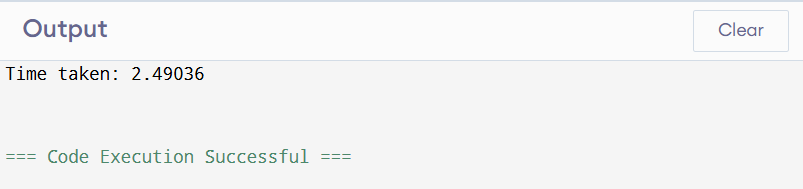
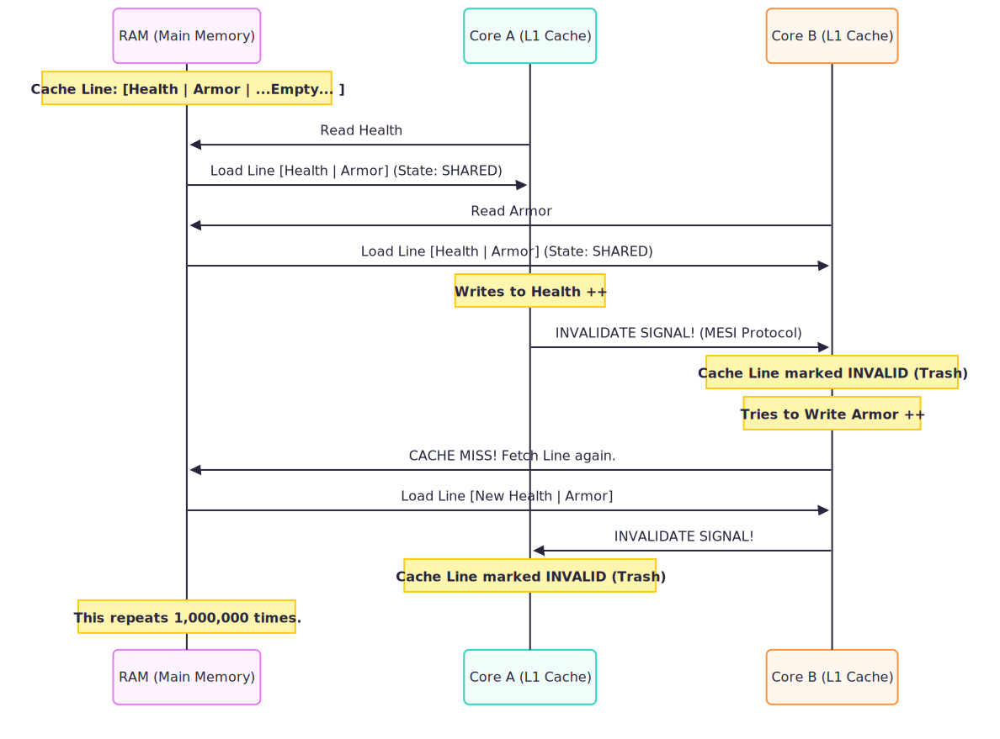

## 01_01_memory_basics_stack_heap
```
void analyze_me(){
    int local_val = 10;
    int* p1 = &local_val;
    int* p2 = new int(20);
}
```
To visualize this, imagine your RAM divided into two primary zones: the **Stack** (managed automatically, fast, LIFO structure) and the **Heap** (managed manually via `new`, slower, flexible size).

### Memory Diagram

| Memory Zone | Contents | Description |
| --- | --- | --- |
| **Stack** | `local_val` (10) | Local primitive variables. |
| **Stack** | `p1` (Address of `local_val`) | A pointer stored locally, pointing elsewhere on the stack. |
| **Stack** | `p2` (Address of `0xHeap...`) | The **pointer variable itself** is local. |
| **Heap** | `20` | The actual integer created by `new int(20)`. |

**The Visual Flow:**

1. `local_val` sits on the stack.
2. `p1` sits on the stack and has an arrow pointing to `local_val` (also on the stack).
3. `p2` sits on the stack, but its arrow crosses over into the **Heap** to point at the value `20`.


---

### Questions

**1. Does the variable p2 (the pointer itself) live on the Stack or the Heap?**
The variable `p2` lives on the **Stack**. In C++, any variable declared inside a function without the `static` keyword (like `int* p2`) is a local variable, and all local variables are allocated on the stack.

**2. Does the integer value 20 live on the Stack or the Heap?**
The integer value `20` lives on the **Heap**. This is because it was created using the `new` keyword. `new` tells the OS to find a spot in the heap large enough for an integer, initialize it to 20, and return that address.

**3. If p2 consumes 8 bytes of memory, where are those 8 bytes located?**
Those 8 bytes are located on the **Stack**. A pointer is just a variable that holds a memory address. While the *data* it points to is on the heap, the 8-byte address (the "house number") is stored in the `p2` slot on the stack.

---
---
<br>

## 01_02_arrays_and_decay

```
void tricky_arrays(){
    int arr[3] = {5,6,7};
    int* p = arr;
}
```

### Memory Diagram (The Stack)

| Stack Address | Variable | Data/Value |
| --- | --- | --- |
| `0x1000` | `arr[0]` | `5` |
| `0x1004` | `arr[1]` | `6` |
| `0x1008` | `arr[2]` | `7` |
| `0x100C` | `p` | `0x1000` (Points to `arr[0]`) |

**The Visual Logic:**

* `arr` occupies **3 contiguous boxes** on the stack.
* `p` occupies **1 box** (8 bytes on a 64-bit system).
* **Crucial Insight:** `arr` does **not** have an arrow. `arr` *is* the boxes. It doesn't "store" the address `0x1000` in a separate variable; it simply starts at that location.


---

### Questions

**1. Does arr have an arrow? (Does arr store a memory address like p does?)**
**No.** This is the "Lie." Unlike the pointer `p`, `arr` is not a separate variable that holds an address. It is a label for a specific block of memory. When you use `arr`, the compiler substituted the address of the first element, but there is no "pointer variable" for `arr` taking up space on the stack.

**2. What is the sizeof(arr)?**
**12 bytes.** Since `arr` is an array of 3 integers and a standard `int` is 4 bytes, the total size is . The array remembers its total size within the scope where it is defined.

**3. What is the sizeof(p)?**
**8 bytes.** On a 64-bit system, all pointers (regardless of whether they point to an `int`, a `char`, or a complex `struct`) are 8 bytes because they must be large enough to hold any possible memory address.

**4. If I assume arr is at address 0x1000, what is the value stored in p?**
The value stored in `p` is **0x1000**. When you execute `int* p = arr;`, the array "decays" into a pointer to its first element (`&arr[0]`).

---
---
<br>

## 01_03_memory_dangling

```cpp
void main() {
    int* p2 = new int(20); // 0x500
    int* p3 = p2;          // 0x500
    
    delete p2;   // Memory at 0x500 is freed
    p2 = nullptr; // p2 is now safe

    *p3 = 50;    // CRASH: p3 is dangling
}

```


### Memory Diagram (Post-Line B)

| Memory Zone | Contents | State |
| --- | --- | --- |
| **Stack** | `p2` | `nullptr` (0x0) |
| **Stack** | `p3` | `0x500` (The Dangling Pointer) |
| **Heap** | `0x500` | **FREED / INVALID** |

---


### **Step-by-Step Visualization**

#### **Step 1: Initialization**

```cpp
int* p2 = new int(20);
int* p3 = p2;

```

**Status:** Both pointers hold the address `0x500`. The Heap at `0x500` is valid (owned by you).


---

#### **Step 2: The `delete` Command**

```cpp
delete p2;  // <--- LINE A

```

**Status:**

* **Stack:** `p2` **STILL** holds `0x500`. It did not change.
* **Stack:** `p3` **STILL** holds `0x500`. It did not change.
* **Heap:** The block at `0x500` is now **DEAD** (Freed).

**CRITICAL:** `p2` is now a "Dangling Pointer". It points to memory that is no longer yours.


---

#### **Step 3: The Safety Measure**

```cpp
p2 = nullptr; // <--- LINE B

```

**Status:**

* **Stack:** `p2` is now `0` (Safe). If you try to use `p2`, it will crash cleanly (Segfault on NULL).
* **Stack:** `p3` **STILL** holds `0x500`. `p3` did not get the memo. It is still pointing to the dead body.


---

#### **Step 4: The Crash (Use After Free)**

```cpp
*p3 = 50; // <--- LINE C

```

**Why it crashes:**

1. The CPU reads the value inside `p3` (`0x500`).
2. It goes to memory address `0x500`.
3. The Memory Manager says: **"HEY! You told me I could have this back! You don't own this anymore!"**
4. **Result:** Segmentation Fault (Crash) or, worse, you overwrite memory that the OS just gave to a completely different part of your program (Heap Corruption).

---
**Q1: After LINE A runs, look at p2 on the Stack. Does the box p2 physically change?**
No, the box `p2` does **not** physically change. It still holds the address `0x500`. `delete` only tells the Heap Manager that the memory at that address is no longer in use; it does not "wipe" the pointer variable on the stack.

**Q2: After LINE A runs, look at the Heap address 0x500. What is there now?**
The value `20` might still be there physically, but logically, it is **Deallocated/Junk**. The Heap Manager marks that block as "Free," meaning it can be overwritten by any other part of the program at any moment.

**Q3: LINE C will crash the program. Why?**
Line C crashes (or causes undefined behavior) because **p3** is a **dangling pointer**. While `p2` was safely set to `nullptr` in Line B, `p3` still holds the address `0x500`. When you attempt to assign `50` to `*p3`, you are trying to write to a memory location that is no longer **valid** for your use.

---

### Key Takeaways

* **Delete vs. Null:** `delete` affects the **Heap**; `nullptr` affects the **Stack**.
* **The Alias Trap:** Setting one pointer to `nullptr` does nothing to other pointers (`p3`) that were copied from it.
* **Safety Rule:** Always be aware of "aliases" (multiple pointers to the same memory). If you delete the memory, all aliases become dangerous.

---
---
<br>

## 01_04_stack_recursion

```python
def recursive(n):
    data = 10  # Local variable
    # STOP HERE
    recursive(n + 1)

recursive(1)

```

### Memory Diagram (At `n=3`)

| Memory Zone | Frame | Contents | State |
| --- | --- | --- | --- |
| **Stack (Top)** | `recursive(3)` | `n=3`, `data=10` | **Active** (Running) |
| **Stack** | `recursive(2)` | `n=2`, `data=10` | **Frozen** (Waiting for n=3) |
| **Stack** | `recursive(1)` | `n=1`, `data=10` | **Frozen** (Waiting for n=2) |
| **Stack (Bottom)** | `Global/Main` | `Script Definitions` | **Frozen** |

---

### **Step-by-Step Visualization**

#### **Step 1: First Call `recursive(1)`**

The CPU creates a new "Stack Frame". It pushes the return address (so it knows where to go back to) and allocates space for `n` and `data`.


---

#### **Step 2: Second Call `recursive(2)**`

`recursive(1)` pauses at the line `recursive(n+1)`. A **new** frame is pushed on top. Crucially, `data` here is a **new integer** at a different address.


---

#### **Step 3: Third Call `recursive(3)`**

The Stack grows deeper. We now have three copies of `10` and three return addresses cluttering RAM.


### **Questions**

**Q1: How many "Frames" are currently active?**<br>
**4 Frames** (Global + 3 recursive calls).
Each frame consumes physical bytes. The CPU context switch must manage these layers.

**Q2: Is it the same `10` in physical RAM?**<br>
**NO.** Each frame has its own distinct copy.
`recursive(1)` has a `10` at address `0x9000`.
`recursive(2)` has a `10` at address `0x8FE0`.
They are totally independent. This is why recursion is memory-heavy compared to loops.

**Q3: What physical hardware limit would you hit?**<br>
**The Stack Pointer Limit (Stack Overflow).**
The Stack is a fixed-size segment of RAM (e.g., 8MB). If you recurse infinitely, the "Stack Pointer" register (ESP/RSP) decrements until it points to an address outside the allowed Stack range. The CPU's Memory Management Unit (MMU) catches this illegal access and triggers a hardware exception (Page Fault), which the OS turns into a crash (Segfault).

---

### **Key Takeaways**

* **Recursion = Allocation:** Every function call is a memory allocation (Stack Frame).
* **Locals are Private:** Variables with the same name in different frames are physically different bytes.
* **The Hardware Limit:** The "Stack" is physically small. Infinite recursion crashes not because of "logic" but because you physically ran out of the reserved RAM slot.

---
---

## 01_05_virtual_memory

```cpp
// Program A (PID: 1001)
int* p = new int(999); // Address: 0x5000

// Program B (PID: 1002)
int* p = new int(888); // Address: 0x5000

```

### Memory Diagram (The "Big Lie")

| Process | Virtual Address (The Lie) | Hardware Map | Physical RAM (The Truth) | Value |
| --- | --- | --- | --- | --- |
| **Proc A** | `0x5000` | **MMU Map** -> Frame #10 | Address `0x800010` | `999` |
| **Proc B** | `0x5000` | **MMU Map** -> Frame #55 | Address `0x900055` | `888` |

---

### **Step-by-Step Visualization**

#### **Step 1: The Request**

Both programs ask the OS for memory. The OS Virtual Memory Manager says: "Sure, you both get `0x5000`."

* Process A writes `999`.
* Process B writes `888`.

#### **Step 2: The Translation (The MMU)**

When Process A's CPU tries to access `0x5000`:

1. The CPU sends `0x5000` to the **MMU**.
2. The **TLB** (Cache) checks: "Do I know where `0x5000` is for Process A?"
3. **Hit:** It points to Physical Frame #10.
4. Data `999` is stored at Physical RAM `0x800010`.


#### **Step 3: The Context Switch**

The OS pauses Process A and switches to Process B.

* **Crucial Step:** The OS **flushes** (clears) the TLB or changes the Page Table Register.
* Now, when Process B asks for `0x5000`, the MMU translates it to Frame #55.
* Process B reads `888`. It has no idea `999` even exists.

---

### **Questions**

**Q1: Same physical RAM cell?**<br>
**NO.** `0x5000` is a virtual offset relative to the process, not a physical location.

**Q2: Does Program B see 1 or 888?**<br>
**888.** Memory is strictly isolated. One process generally cannot touch another's memory without explicit Shared Memory setup.

**Q3: The Hardware Component?**<br>
**MMU (Memory Management Unit).**
* **Nuance:** The TLB is the *cache* inside the MMU. If you said TLB, you are thinking about performance (which is good), but the MMU is the actual hardware unit doing the work.

---

### **Key Takeaways**

* **Pointers are Liars:** In C++, `&x` is never the real address. It is a virtual key.
* **Protection:** If Process A goes rogue and writes to random pointers, it destroys its own virtual space, but it cannot overwrite Process B's physical frames (Segfault).
* **The Cost:** Every memory access goes through the MMU. This is why TLB Hits are critical for speed.

---
---

# 01_06_cpu_cache_false_sharing

```cpp
#include <iostream>
#include <thread>
#include <chrono>


struct PlayerStats{
    long health;
    long armor;
};
PlayerStats stats;

void updateHealth(){
    for(int i=0; i<100000000; i++){
        stats.health++;
    }
}

void updateArmor(){
    for(int i = 0; i<100000000; i++){
        stats.armor++;
    }
}

int main(){

    auto start = std::chrono::high_resolution_clock::now();

    std::thread t1(updateHealth);
    std::thread t2(updateArmor);

    t1.join();
    t2.join();

    auto end = std::chrono::high_resolution_clock::now();
    std::chrono::duration<double> diff = end -start;

    std::cout<<"Time taken: "<< diff.count() << std::endl;

    return 0;
}
```

## Output:
 

## Theory

**What is a Core?** <br>
A Core is a complete independent CPU execution unit. It has its own Registers and its own L1/L2 Cache. It shares the main RAM and L3 Cache with other cores. Core A can not look at Core B's L1 Cache.

**Cache Line (The Granularity of RAM)** <br>
The CPU never reads a single byte or a single integer(4 bytes) from RAM. It is too slow. Instead it grabs a Chunk of memory called a Cache Line.
    * Standatd Size: 64 Bytes
    * If you ask for `health` (8 bytes), the CPU drags the entire 64 byte neighborhood (including armor) into the cache.

**MESI Protocol** <br>
Since Core A and core B have separate caches they must agree on the truth. A cache line can only be written by one core at a time. If Core A modifies any byte in the line, Cre B's copy of the entire line is marked Invalid. Core B is forced to dump its cache and re-fetch from RAM.


## Memory Visualization (The Ping-Pong War)


**Step-by-step Ecplanation**
    1. **Load**: Core A loads the Cache line to edit health. Core B loads the line to edit armor.
    2. **Conflict**: Core A modifies `health`. Hardware requires exclusive ownership of th whole Cache line.
    3. **Kill**: Core A sends a signal to all: "I touched this line. Everyone else destroy your copies(Invalidate).
    4. Core B tries to write `armor`. It looks in its cache. The line is dead. It must pause, go to RAM and fetch the updated line from Core A.
    5. Core B modifies `armor`. It now owns the line. It kills Core A's copy.
    6. **Result**: This turned a memory operation(1 cycle) into hardware synchronization war (100+ cycles).


 # Fix:
 We must ensure `health` and `armor` live on different Cache Lines so the cores dont fight.
 Use `alignas` to force the compiler to put health and armor in different Cache Lines.

 ```cpp
#include <iostream>
#include <thread>
#include <chrono>       // chrono is a modern c++ time library


struct PlayerStats{
    alignas(64) long health;       // <- Used alignas
    alignas(64) long armor;         // <- Used alignas
};
PlayerStats stats;

void updateHealth(){
    for(int i=0; i<100000000; i++){
        stats.health++;
    }
}

void updateArmor(){
    for(int i = 0; i<100000000; i++){
        stats.armor++;
    }
}

int main(){

    auto start = std::chrono::high_resolution_clock::now();

    std::thread t1(updateHealth);
    std::thread t2(updateArmor);

    t1.join();
    t2.join();

    auto end = std::chrono::high_resolution_clock::now();
    std::chrono::duration<double> diff = end -start;

    std::cout<<"Time taken: "<< diff.count() << std::endl;

    return 0;
}

```

## 